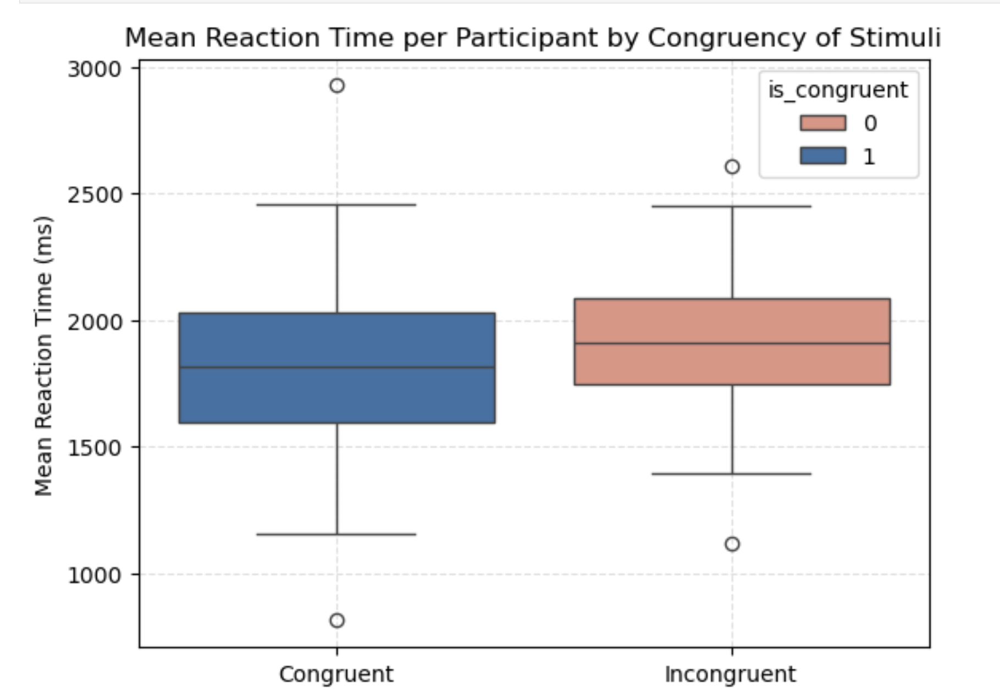
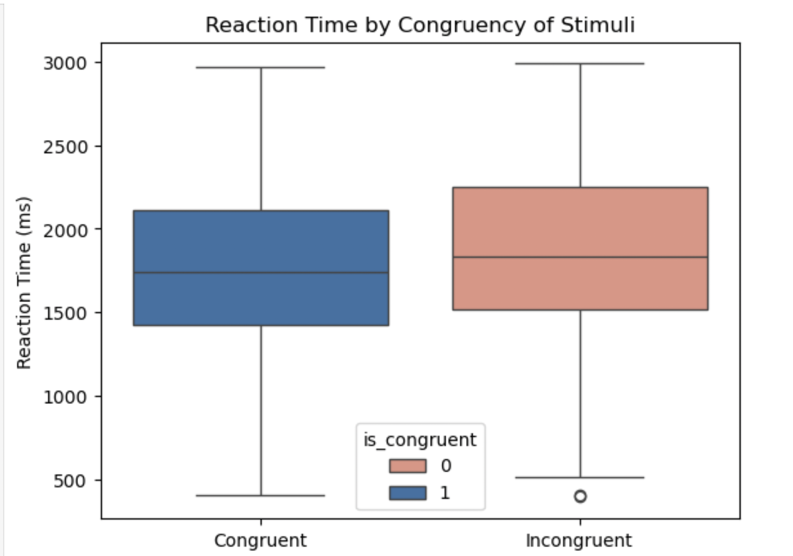
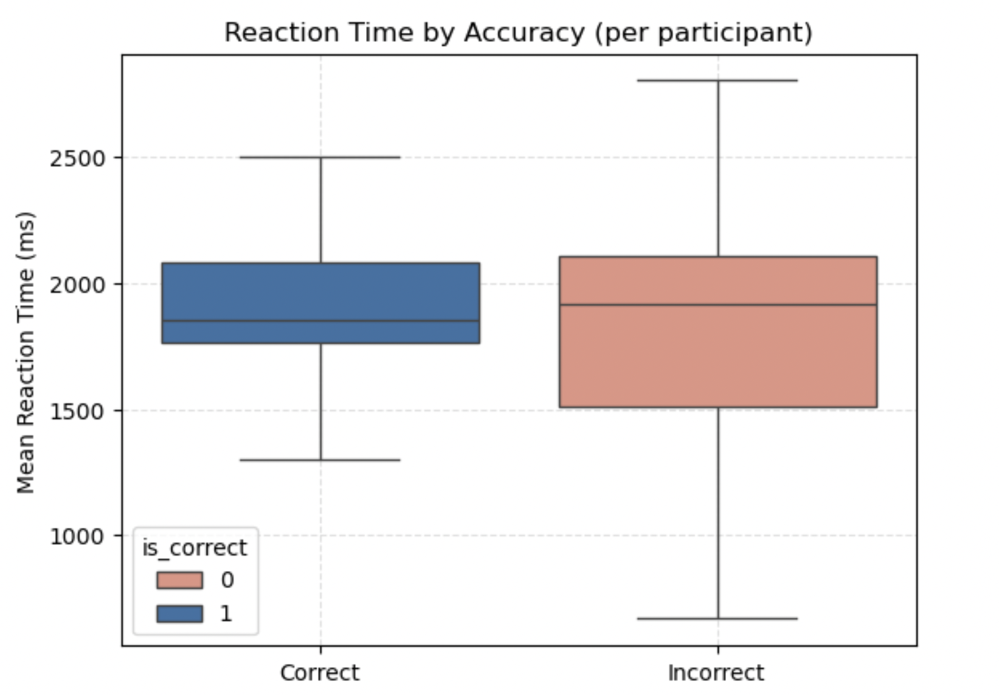
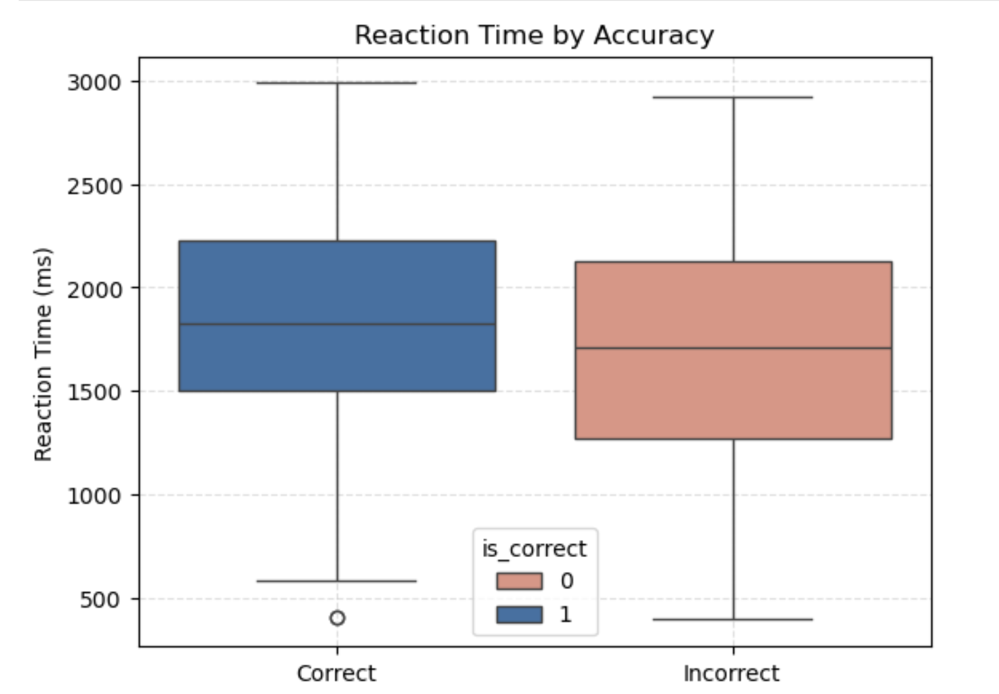
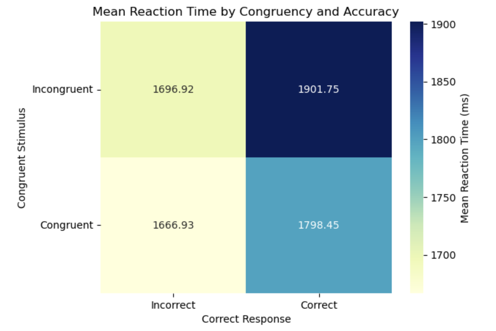
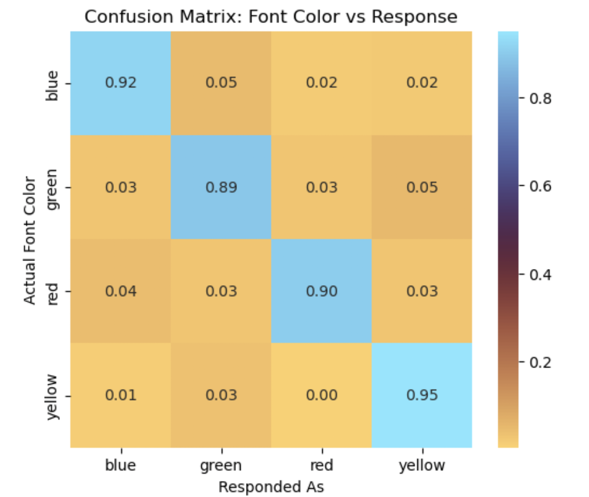

# Stroop Task Reaction Time Analysis
This project analyzes data from a Stroop test, a classic cognitive psychology experiment designed to assess selective attention, cognitive control, and processing interference.

## What is the Stroop effect?
The Stroop effect is a psychological phenomenon that demonstrates the interference between automatic and controlled processes in the brain.

In its most common example, it is observed that participants in a **Stroop test** take longer to name the colour of ink in which a word is printed, when the colour of the ink and the word itself are incongruent.

## Overview
Participants were shown words naming colours, either:

Congruent: word and ink colour match (e.g., “Red” in red ink)

Incongruent: word and ink colour mismatch (e.g., “Blue” in green ink)

They were asked to identify the colour of the ink, not read the word. The reaction times for each trial were recorded and analyzed to measure interference effects. Each participant was requested to complete 20 trials. 

Data analysis was done on both a trial and participant level, as participant IDs were not originally recorded. I divided the dataset into groups of 20 trials respectively. This does limit the accuracy of the experiment as it relies on the every participant completing 20 trials and the data being perfectly chronological.

**To view the test:** https://stroop-test.onrender.com

## Tools and Libraries:
pandas, numpy, matplotlib, seaborn, scipy.stats and sklearn

## Contents
* **Stroop_Test_Notebook.ipynb**: Main Jupyter notebook with complete analysis and visualizations

* **stroop_results_final.csv**: Folder containing participant-level trial data

* **README.md**: Project overview and methodology

## Conclusion

This project explored the Stroop effect, analyzing how stimulus **congruency**, **accuracy**, and **reaction time** interact in a cognitive interference task. Key findings include:

* Participants responded significantly faster to congruent stimuli compared to incongruent ones, confirming the expected Stroop interference. This was proven by both paired and unpaired t-test. 

* A speed-accuracy tradeoff was observed, with faster responses tending to be less accurate. However, this effect was not especially prominent in this data set, as shown by correlation tests. 

* Incorrect-congruent trials had the fastest reaction times, while correct-incongruent trials were the slowest, highlighting the cognitive cost of resolving interference accurately, as depicted by this correlation matrix. 

* Reaction time did not show any particular trend of increasing or decreasing over trials. However, accuracy did improve over trials, suggesting possible learning or increased task familiarity. This was shown through logistic regression and one sample t-tests. 

* The color–response heatmap revealed patterns of confusion, which may inform how certain colors or words introduce greater cognitive conflict.

Together, these insights reinforce how automatic processing (reading) competes with controlled processing (color naming), making the Stroop task a powerful tool for studying attention and cognitive control.
